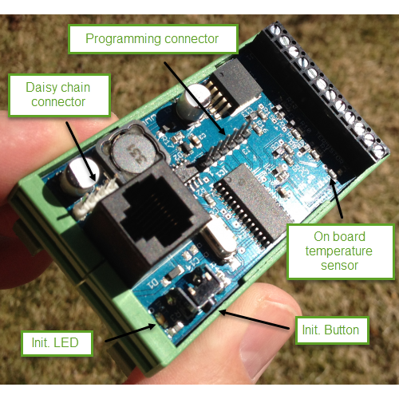
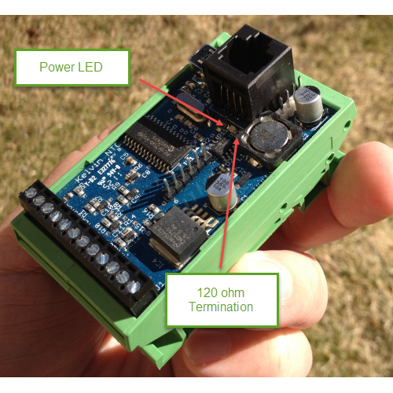
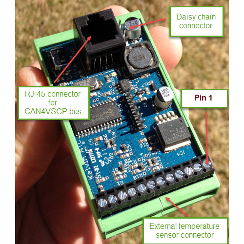

# Hardware

## Most current information

You can find the most current information about the Kelvin NTC10K module [here](https://github.com/grodansparadis/can4vscp_kelvin_ntc10k). On the site you can also find links to the latest firmware, drivers and schematics etc for its use.

## Installing the module

Connect the module to the CAN4VSCP bus. The red LED on the module should light up indicating that the device is powered. If this is the first time you start up the module the green lamp next to the initializing button will start to blink. This means that the module is trying to negotiate a nickname address with the rest of the modules on the bus. When it found a free nickname the green LED will light steady. If the green led does not start to blink press the initialization button until it does.

Remember that you need at least two devices (a CAN interface count as one) on the bus for it to work. If you only have one device on the bus it will not work. A single device can't talk to itself on a bus. It's an error.

Now your module is ready to use. 

## The raw facts

| Parameter | Value |
| --------- | ----- |
| Current hardware reversion | B |
| Current firmware version | 1.2.7 |
| Supply voltage | +9-+28 VDC |
| PCB Size | 42mm x 72mm |
| Mounting options | DIN or wall |
| Power requirements | 0.1W |
| Communication: CAN4VSCP (CAN) | 125 kbps |
| Number of sensors supported | 6 (one internal) |

## Schematics

Schematics: Rev B  (right click and select view image to see it in full size)

## Components

The green **Init LED** show operational status. It blinks during initialization process and lights steady under normal operation.

Press the **init. button** to initiate the node id discovery process. The green led will start to blink and do so until a new nickname id is found. If the LED never stops blinking that is an indication of some bus fault of some kind. Typically the module does not get an answer from another module on the bus.

The **daisy chain** connector is described below.

The firmware of a circuit equipped with a Microchip microprocessor usually can be programmed in circuit. That is when it is mounted on a printed circuit board. This is also true for the Paris relay module which have the programming connector on-board (J3). The **programming
connector** is used to reprogram the module. This is more convenient to do using the bootloader software but in debugging or if the bootloader has gotten corrupt connecting a standard Microchip PIC programmer to this connector is the only way to reprogram the module. If you have a programmer for Microchip processors (Real ICE, ICD-2, ICD-3, PICKIT-2, PICKIT3 or other) you can program your own firmware or the latest official firmware into the module using MPLABX or similar tools. You can always find a link to the latest firmware on the [Kelvin NTC10K module
home page](https://www.grodansparadis.com/kelvinntc10k/kelvin_ntc10ka.html).

The **power LED** (red) will light when the board is powered.

The **termination jumper** is used to activate the 120 ohm termination resistor between CANH and CANL if present. This is convenient if the module is the first or last module on a bus.

## Connectors

To activate the **termination** solder a cable between holes. This will activate the 120 ohm resistor between CANH and CANL.

### Terminal block

  

The individual positions for the twelve position termination block is numbered from the right (looking into it) as in the figure below.

| Pin | Description |
| --- | ----------- |
| 1 | Ground (GND) |
| 2 | +5V |
| 3 | Temperature sensor 1 |
| 4 | +5V|
| 5 | Temperature sensor 2|
| 6 | +5V|
| 7 | Temperature sensor 3 |
| 8 | +5V |
| 9 | Temperature sensor 4 |
| 10 | +5V |
| 11 | Temperature sensor 5 |
| 12 | +5V |

where all temperature sensor inputs looks like this

## Internal temperature sensor

The internal temperature sensor used on the Kelvin NTC10KA is the [Murata NCP21XV103J03RA](https://www.google.se/url?sa=t&rct=j&q=&esrc=s&source=web&cd=1&cad=rja&uact=8&ved=0ahUKEwiu-ujjlrnJAhWDjiwKHY9aCQQQFggiMAA&url=http%3A%2F%2Fwww.murata.com%2F~%2Fmedia%2Fwebrenewal%2Fsupport%2Flibrary%2Fcatalog%2Fproducts%2Fthermistor%2Fntc%2Fr44e.ashx&usg=AFQjCNE0U3R9tCH8Mm3JbRtiqhAN5yqOaQ&sig2=3Ga5yx9Fc6e15Gvr6YVbPg). Data for this sensor is as follows

| Description | Value |
| ----------- | ----- |
| Time constant | 10 s |
| B[25/100]- value | 3944K |
| Temperature range |-40...+125ºC |
| Resistance tolerance | 5% |
| Resistance @ 25ºC | 10 Kohm |
| Max effect | 210 @ 25ºC mW |
| B[25/50]- value | 3900 |
| B[25/85]- value | 3934 |
| B[25/100]- value | 3944K 3% |
| Max error (B[25/100])	| 2.8 (%/C) |

As stated elsewhere this sensor will show a temperature value that is to high due to the fact that it is heated by the processor and other components on the board. You can calibrate this away if you want. The sensor is used to show the temperature of the board and is not intended to be used for high precision measurements.

### RJ-XX pin-out

The unit is powered over the CAN4VSCP bus. The CAN4VSCP normally uses CAT5 or better twisted pair cable. You can use other cables if you which. The important thing is that the CANH and CANL signals uses a twisted cable. For connectors you can use RJ10, RJ11, RJ12 or the most common RJ45 connectors.

Recommended connector is RJ-34/RJ-12 or RJ-11 with pin out as in this table.

| Pin     | Used for  | RJ-11  | RJ-12 | RJ-45 |  Patch Cable wire color T568B |
|:-------:|:---------:|:------:|:-----:|:-----:| ----------------------------- |  
|  1      | +9-28V DC |        |       | RJ-45 | Orange/White |
|  2 1    | +9-28V DC |        | RJ-12 | RJ-45 | Orange |
|  3 2 1  | +9-28V DC | RJ-11  | RJ-12 | RJ-45 | Green/White |
|  4 3 2  | CANH      | RJ-11  | RJ-12 | RJ-45 | Blue |
|  5 4 3  | CANL      | RJ-11  | RJ-12 | RJ-45 | Blue/White |
|  6 5 4  | GND       | RJ-11  | RJ-12 | RJ-45 | Green |
|  7 6    | GND       |        | RJ-12 | RJ-45 | Brown/White |
|  8      | GND       |        |       | RJ-45 | Brown |

Always use a pair of twisted wires for CANH/CANL for best noise immunity. If the EIA/TIA 56B standard is used this condition will be satisfied. This is good as most Ethernet networks already is wired this way.

### Inter module connector

The inter module connector can be used to connect modules that are physically close to each other together in an easy way. Remember that the minimum length of a connection cable is 30 cm.

The **daisy chain connector** is an alternative to the RJ-45 connector and can be a very convenient way to connect boards together that are mounter close to each other, in the same cabinet for example. The [power injector board](http://www.grodansparadis.com/pwrinjectcan/pwrinjectcan.html) is a perfect companion for this use.

| Pin | Description |
| :---: | ----------- |
| 1   | Power from CAN4VSCP bus (+9V-24V) |
| 2   | CANH |
| 3   | CANL |
| 4   | GND |

### PIC programming Connector

| pin | Description |
| :---: | ----------- |
| 1   | Reset |
| 2   | VCC |
| 3   | GND |
| 4   | PGD (RX of second serial port is here to) |
| 5   | PGC (TX of second serial port is here to) |
| 6   | LWPGM |

### Functionality of the status LED

The LED is used to indicate the status of the module. It will light steady when the firmware is running and will blink when the module is in the nickname discovery process.

| LED | Description |
| :---: | ----------- |
| Steady | No error. Firmware running. |
| Blinking | Module is going through the [nickname discovery process](https://grodansparadis.github.io/vscp-doc-spec/#/./vscp_level_i_specifics?id=address-or-nickname-assignment-for-level-i-nodes). |

### CAN

CAN4VSCP is a CAN based bus running at 125 kbps with the addition of DC power. If you are interested in how CAN works you have a pretty good intro [here](http://www.eeherald.com/section/design-guide/esmod9.html).

CAN is known to be robust and is there for used in vehicles and in the industry for that reason.

  
[filename](./bottom-copyright.md ':include')
